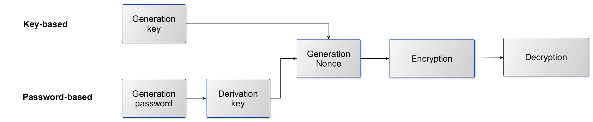
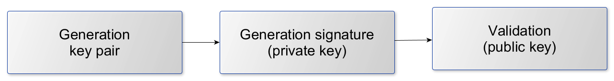

<i> Version: 1.0, 2018-10-12</i>

# CryptoExamples-Guidelines
Guidelines for creating secure, complete, minimal, copyable and tested crypto code examples for [CryptoExamples](https://www.cryptoexamples.com).

By creating your *CryptoExample* you must follow these guidelines. Deviations are possible, but need to be justified.

## General Requirements

In general all examples must satisfy the following general requirements:

- [ ] The example code is secure.
- [ ] The example code is minimal.
- [ ] The example code is complete.
- [ ] The example code is tested.
- [ ] The example code is runnable.

*Some of them may conflict. Most conflicts can be resolved by following the guidelines.*

## Implementation / Example Code
### Code

- [ ] Compliant with current coding guideline.
  - **Static code analysis**: use static code analysis tools such as ["Checkstyle"](http://checkstyle.sourceforge.net/), ["StyleCop"](https://archive.codeplex.com/?p=stylecop) or ["Pylint"](https://www.pylint.org/)
- [ ] Code can be executed with latest stable version of the programming language.
- [ ] Code can be executed with the latest stable version of the common tool chain of the programming language.
- [ ] Only uses algorithms and concepts that are secure.
  - **Static code analysis**: ["SpotBugs/FindSecBugs"](https://spotbugs.github.io/), ["OWASP Dependency Check"](https://www.owasp.org/index.php/OWASP_Dependency_Check), ["Bandit"](https://pypi.org/project/bandit/)
- [ ] No standard library functionality can cover this scenario with all requirements of CryptoExamples.
- [ ] Import/Using statements are explicit (to avoid ambiguity if no fully qualified method/class names are used).
- [ ] Program output is made through a logging-facility (logger) and not via unfiltered system output like `System.out`/`print`/`echo`.
- [ ] Exceptions are caught except runtime exceptions.
- [ ] Exceptions are caught at the end (to not clutter the rest of the code).
- [ ] Exceptions are logged via the logging facility.
- [ ] No stack-trace is printed.
- [ ] The code demonstrates how its security functionality can be evaluated (e.g. by logging a conditional message that states the success or no success)
- [ ] The example code is tested with (a) unit test(s).
- [ ] Byte arrays are encoded for output.
- [ ] Strings are encoded using UTF-8.

### Code comments / code documentation
- [ ] Class Documentation describes functionality.
- [ ] Class Documentation lists used algorithms and concepts.
- [ ] Inline comments describe essential (for non-security educated human beings) parts of the code.

## Scenario specific guidelines
### Choosing secure algorithms and concepts

- [ ] Consulted two trustworthy sources for choosing a specific algorithm. [National Institute of Standards and Technology (NIST)](https://www.nist.gov/), [BSI](https://www.bsi.bund.de/DE/Home/home_node.html), [Cryptographic Mechanisms: Recommendations and Key Lengths](https://www.bsi.bund.de/SharedDocs/Downloads/EN/BSI/Publications/TechGuidelines/TG02102/BSI-TR-02102-1.pdf?__blob=publicationFile&v=7)
- [ ] Consulted two trustworthy sources for choosing the keylength. [Keylength.com by BlueCrypt](https://www.keylength.com/en/compare/), [Cryptographic Mechanisms: Recommendations and Key Lengths](https://www.bsi.bund.de/SharedDocs/Downloads/EN/BSI/Publications/TechGuidelines/TG02102/BSI-TR-02102-1.pdf?__blob=publicationFile&v=7), [Recommendation for Key Management. Part 1: General](https://nvlpubs.nist.gov/nistpubs/SpecialPublications/NIST.SP.800-57pt1r4.pdf)

### Overview of secure cryptographic algorithms and parameter choices

Last updated: 2018-09-13. Next update: 2018-11-13

| Concept | Choices | Sources |
| ------- | ------- | ------- |
| **Hashing**| SHA1-2: SHA-256/384/512   SHA-3: SHA3-256/384/512    Length >= 256 Bit (2018-2022, BSI) | [1] (2018-2022), [2],  [3] (BSI, 2018-2022), [4]|
|**Symmetric encryption**| ||
|Blockcipher|AES2-128/192/256   Block-size >= 128 Bit  (only in combination with a mode) |[1] (2018-2022), [2], [4]|
|Modes|CCM3, GCM4  (only authenticated encryption)|[1] (2018-2022), [4], [5] |
|Key|>= 128 Bit |[3] (2018-2022, BSI) |
|Salt/Nonce|>= 128 Bit   (depending on the chosen algorithm)|[6]|
|MAC5|CMAC, GMAC, HMAC   Block-size >= 128 Bit,  Tag-length >= 96 Bit |[1] (2018-2022), [2]|
|**Password derivation**| | |
|PBKDF26|HMAC   Iteration >= 10.000 |[6]|
|**Asymmetric encryption**| | |
|RSA7</sup| Key-length >= 2.000 Bit (2.048 or 4.096 Bit) | [1] (2018-2022), [4], [7]|
|ECIES8| Key-length >= 250 Bit |[3] (BSI, 2018-2022)|
|DLIES9| Key-length >= 2.000 Bit |[1] (2018-2022)|

#### Abbreviations:
1 : Secure Hash Algorithm 
2 : Advanced Encryption Standard 
3 : Counter with CBC-MAC 
4 : Galois/Counter Mode 
5 : (Galois/Cipher-based/Hash-based) Message Authentication Code 
6 : Password-Based Key Derivation Function 2 
7 : Rivest Shamir Adleman 
8 : Elliptic Curve Integrated Encryption Scheme 
9 : Discrete Logarithm Integrated Encryption Scheme

[1]: https://www.bsi.bund.de/SharedDocs/Downloads/EN/BSI/Publications/TechGuidelines/TG02102/BSI-TR-02102-1.pdf?__blob=publicationFile&v=7
[2]: https://nvlpubs.nist.gov/nistpubs/SpecialPublications/NIST.SP.800-57pt1r4.pdf
[3]: https://www.keylength.com/en/compare/
[4]: https://www.iana.org/assignments/tls-parameters/tls-parameters.xhtml#tls-parameters-4
[5]: https://nvlpubs.nist.gov/nistpubs/Legacy/SP/nistspecialpublication800-38a.pdf
[6]: https://nvlpubs.nist.gov/nistpubs/Legacy/SP/nistspecialpublication800-132.pdf
[7]: https://nvlpubs.nist.gov/nistpubs/specialpublications/nist.sp.800-57pt3r1.pdf

### Cryptographic Hashing / Message Digest

- [ ] Created or accepted a string to be hashed.
- [ ] Regarded the encoding of the string.
- [ ] Created the hash.
- [ ] Encoded the hash to be represented as string.

### Symmetric Encryption

#### Key-based
- [ ] Created or accepted a plaintext string to be encrypted.
- [ ] Used a cryptographically suitable random number generator.
- [ ] Used an authenticated encryption algorithm.
- [ ] Regarded the encoding of the string.
- [ ] Encrypted the plaintext.
- [ ] Encoded the ciphertext to be represented as string.
- [ ] Decrypted the ciphertext.
- [ ] Encoded the decrypted bytes to be represented as string.

#### Password-based
- [ ] Created password or accepted a password to be used for encryption.
- [ ] Derived an appropirate key from the password using a secure method.
- [ ] Used a cryptographically suitable random number generator.
- [ ] Regarded the encoding of the string.
- [ ] Encrypted the plaintext.
- [ ] Encoded the ciphertext to be represented as string.
- [ ] Decrypted the ciphertext.
- [ ] Encoded the decrypted bytes to be represented as string.
- [ ] Salt for PBKDF2 (Password-Based Key Derivation Function 2) should be at least the size of the used hash function (e.g. 32 bytes for SHA-256).

### Asymmetric Encryption
- [ ] Created or accepted a plaintext string to be encrypted.
- [ ] Created a key pair.
- [ ] Regarded the encoding of the string.
- [ ] Encrypted the plaintext using the public key.
- [ ] Encoded the ciphertext to be represented as string.
- [ ] Decrypted the ciphertext using the private key.
- [ ] Encoded the decrypted bytes to be represented as string.

### Signatures/Signing
- [ ] Created or accepted a plaintext string to be signed.
- [ ] Created a key pair.
- [ ] Regarded the encoding of the string.
- [ ] Create a signature using the private key.
- [ ] Used secure algorithms for signing.
- [ ] Encoded the signature to be represented as string.
- [ ] Verified the created signature using the public key.

### Key Management

## Language specific guidelines

- [ ] Defined example code method like: demonstrate$SCENARIO
- [ ] Example code method accepts appropriate parameter (usually String).
- [ ] The example only contains one defined method for the example demonstration AND a main method
- [ ] Main method calls the demonstrator method with parameter
- [ ] Return a result depending on the application output

### Java, C# specific guidelines

- [ ] Named class like: Example$SCENARIO
- [ ] Defined class as "public"

## General
### Documentation (provided via Markdown file)

- [ ] Heading formatted like: $PROGRAMMING_LANGUAGE_NAME $SCENARIO using $LIBRARY_NAME
- [ ] Heading above code formatted like: Example Code for $HEADING_WITHOUT_USING_LIBRARY using $IMPORTANT_ALGORITHMS_AND_CONCEPTS
- [ ] Listed use cases for this code example/scenario
- [ ] Used long form of abbreviated terms the first time the abbreviation is used, except for headings
- [ ] Stated used language versions
- [ ] Described additional requirements to make the example work (e.g. programming environment, operating system).
- [ ] Described how other libraries need to be installed and configured.
- [ ] Put references to official documentation sources for the used classes/methods/packages/modules
- [ ] Put references to official documentation sources for the used algorithms/concepts/parameters
- [ ] Put author name
- [ ] Removed previous review (changes invalidate a previous review of this example)
- [ ] Updated the `last_update` metadata
- [ ] Put appropriate tags
